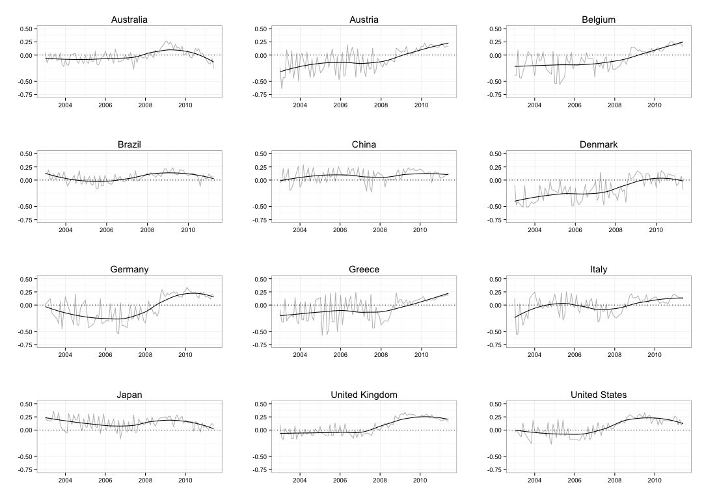

# Machine Index of Financial Market Stress (MIFMS)

**Note: This work is in the early stages of development. It will be updated significantly.**

## What

Measure of financial market stress based on machine classification of
[Economist Intelligence Unit](http://www.eiu.com/) monthly country reports.

## Motivation

A wide range of political economy research on the causes, responses to, and effects of banking crisis needs an accurate and reliable measure of banking crises that is comparable across countries and ideally includes information on crisis severity. Most research to date uses one of two series of crisis data: Reinhart and Rogoff (2009) or Laeven and Valencia (2013). These measures are lacking in that they are simple dichotomous indicators of financial crisis and differ considerably in their start and end dates for many incidents. They are also constructed after the fact and so tend to be biased towards severe crises and away from those where government responses effectively calmed emerging trouble. Recent efforts, namely Jing et al. (2015), Rosas (2009), and Romer and Romer (2014) have attempted to develop more reliable measures of crises that also include continuous information on severity. Each of these approaches have important shortcomings. Jing et al.’s measure is based on central bank’s policy responses, which researchers may want to examine as a dependent variable. Rosas relies on nationally reported banking system data, but as Copelovitch, Gandrud, and Hallerberg (2015) show the reporting of this data is often endogenous to financial system difficulties. Romer and Romer’s approach relies on very time intensive human coding of texts from the OECD and aggregates these codings using a simple summation method. Their approach, though it avoids the issues present in Jing et al. (2015) and Rosas (2009), is very laborious to construct, subjective, and equally weights each item in their coding scheme, which may not be reasonable. In this paper we build on Romer and Romer’s approach with kernel principle component analysis of [Economist Intelligence Unit](http://www.eiu.com/) monthly country reports to develop a new indicator of financial market distress. We compare our measure to previous methods.

## Preview

This is the output of a very early version of the MIFMS (kernal PCA version)
for 12 countries:

