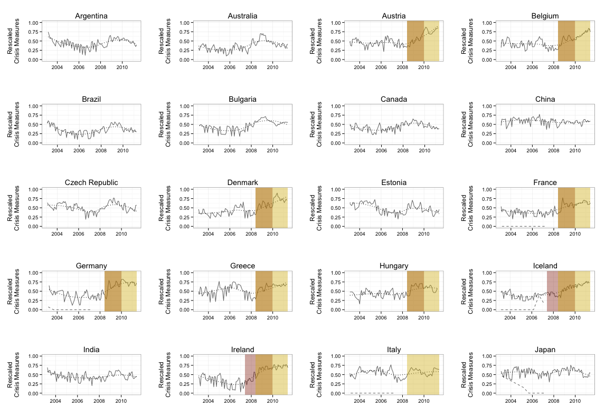

# FinStress: Real-time Perceptions of Financial Market Stress

**Note: Work In Progress.**

## What

Indicator of real-time perceptions of financial market stress based on machine
classification of [Economist Intelligence Unit](http://www.eiu.com/) monthly
country reports.

Currently the Index is estimated for all EIU countries from 2003 through 2011.

## About

Comparative quantitative research into the causes, responses to, and effects of banking crisis uses two series of crisis data: Reinhart and Rogoff (2009, 2010) or Laeven and Valencia (2013, and their predeces- sors). While these data sets provide broad coverage, the measures they code have several shortcomings. They are constructed post hoc and so tend to be biased towards severe crises and away from circum- stances where governments effectively calmed emerging trouble. They suffer from clear selection bias. Because they are simple dichotomous indicators of financial crisis, they do not indicate crisis severity. Our goal in this paper is to create a measure that is accurate, reliable, comparable across countries, and includes information about crisis severity. We use a kernel principal component analysis (PCA) of Economist Intelligence Unit (EIU) monthly country reports to develop a new real-time and continuous measure of perceived banking system stress. We refer to this measure as the EIU Perceptions of Financial Market Stress (FinStress) Index. We not only develop a novel indicator of financial market stress, but also make a contribution to the wider political science and finance literatures on measurement by demonstrating how kernel PCA can be used to efficiently summarise vast quantities of qualitative texts into useful continuous cross-sectional time-series indicators. Finally, we provide an application of our measure demonstrating that governments reveal more of the debt created by responding to financial market stress when they are electorally safe.

## Preview

The following figure shows a selection of financial market stress perceptions scores (solid grey lines). It also compares these scores to other measures of financial market stress and crisis. Dashed lines show Romer and Romer (2015). Red boxes are for Reinhart and Rogoff (2009). Yellow boxes are for Laeven and Valencia (2013).



## Download

To download the development version of the Index into R use:

```{S}
URL <- 'https://raw.githubusercontent.com/christophergandrud/EIUCrisesMeasure/master/data/results_kpca_rescaled.csv'
epfms_index <- rio::import(URL)
```

The primary indicator is labelled: `C1_ma`. See the
[paper](https://github.com/christophergandrud/EIUCrisesMeasure/blob/master/summary_paper/summary_paper.pdf)
describing the Index for more details.
